# Environmental Health Awareness City-Building Game

**Authors:** Suranjan Gautam and Alexander Lain

    

## Project Description

The Environmental Health Awareness City-Building game is a city-building game/simulation where the player takes on the role of the city's mayor. The player's objective is to balance the economic development of their city with the health of the city's environment and population. Throughout gameplay, the player will be exposed to the tension between economic gains and the long-term health consequences of industrial expansion. Success relies on their ability to resolve this tension.

## Gameplay Overview

The player starts the game with an empty, tile-based board to develop. Immediately, the player will have access to several user interface elements. The elements on the upper half of the screen provide important information for the player's decision making, such as:

- How much money they can allocate to infrastructure development
- The health and happiness of their population  
- The level of pollution in the city

The bar in the lower half of the screen provides options for infrastructure development and demolition.

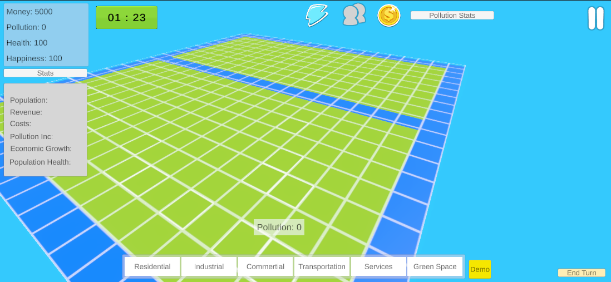
*Figure 1: An Initialized Board*

### User Interface Elements

There are additional elements that are exposed after interacting with specific icons. On the upper end, these include icons for energy, population, and economic statistics. On the lower end, selecting one of the infrastructure options will expand a menu that includes the available options within the category and the cost to build them.

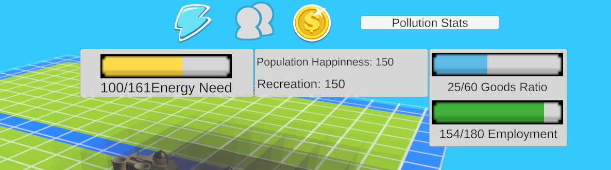
*Figure 2: Additional User Interface Information*

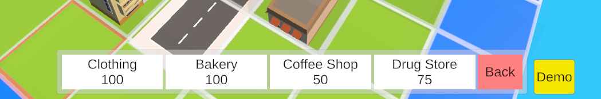
*Figure 3: Infrastructure Options After Selecting "Commercial"*

### Turn-Based Mechanics

The time left until a turn is over is tracked by an icon in the upper-right corner. Turn-based mechanics simulate the passage of time, with each turn corresponding to a set amount of real-world time. In this time, the player will gain resources, such as money and development space, from their infrastructure and investments. Using these resources, the player can develop infrastructure on their tiles.

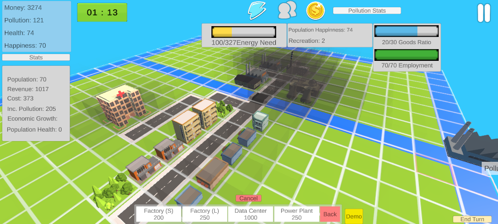
*Figure 4: A Board after Multiple Turns of Development*

## Infrastructure Types

Developing infrastructure will update the metrics that the player has available. Key metrics include the money the player has available to develop, the level of pollution, the population's health, and the population's happiness. Specific buildings will correspond to increasing different metrics:

### Commercial Buildings
- **Purpose:** Increase available employment
- **Examples:** Clothing stores, drug stores, coffee shops, bakeries

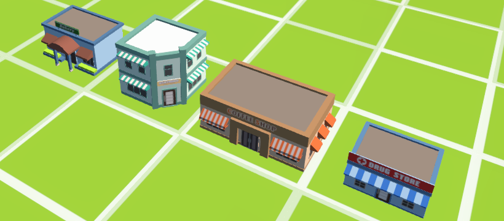
*Figure 5: Commercial Buildings (Clothing, Drug, Coffee, and Bakery Stores)*

### Residential Buildings
- **Purpose:** Increase the city's population
- **Examples:** Houses and apartments

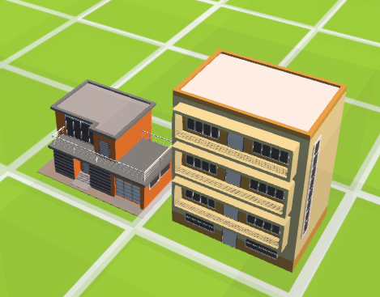
*Figure 6: Residential Buildings (House and Apartment)*

### Industrial Buildings
- **Purpose:** Generate income and pollution
- **Examples:** Factories and power plants

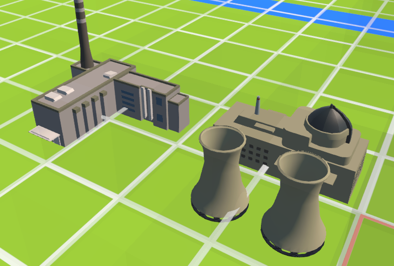
*Figure 7: Industrial Buildings (Factory and Power Plant)*

### Service Buildings
- **Purpose:** Provide essential services (drain money over time but provide benefits)
- **Examples:** Hospitals and schools

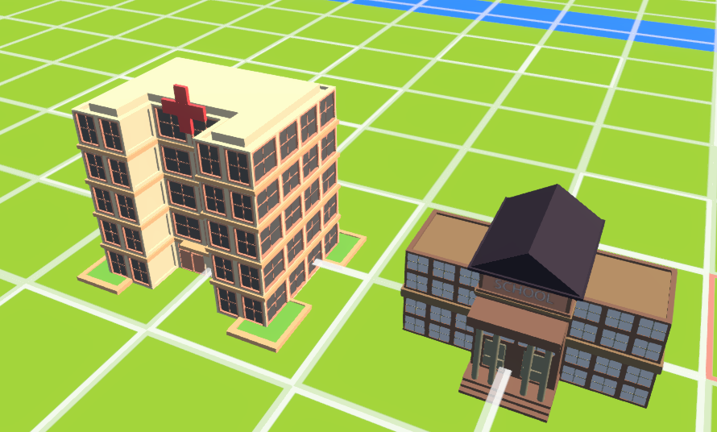
*Figure 8: Service Buildings (Hospital and School)*

### Transportation Tiles
- **Purpose:** Connect different buildings and enable functionality
- **Examples:** Roads and bridges

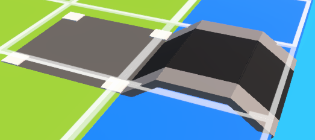
*Figure 9: Transportation Tiles (Road and Bridge)*

### Green Spaces
- **Purpose:** Decrease pollution while increasing population happiness and recreation
- **Examples:** Parks and trees

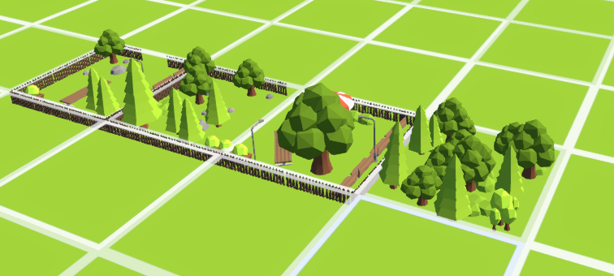
*Figure 10: Green Spaces (Parks and Trees)*

## Building Interactions

Infrastructure on these tiles will also interact with each other based on proximity and connection via transportation tiles. For example:

- A tile corresponding to a commercial or industrial activity cannot have employees unless it is connected to a residential building by a road tile
- Industrial and commercial properties can generate air pollution, which will negatively affect the health of the population in nearby residential tiles

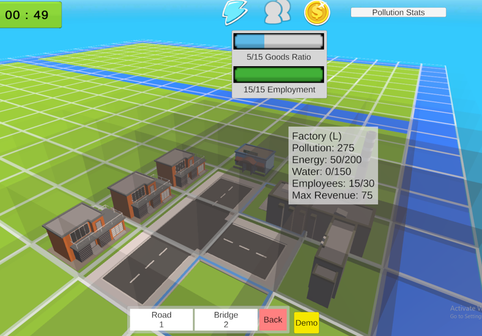
*Figure 11: Houses Connected to a Factory and Store Through Road Tiles*

## Event System

Infrastructure development is not the only kind of choice that the player will have available. An event system will challenge and reward players by prompting them with new situations. Some of these events will be prompted by chance and others will be direct consequences of the player's actions in previous turns. Typically, a non-playable character will prompt the player with the situation through text, providing options to choose from.

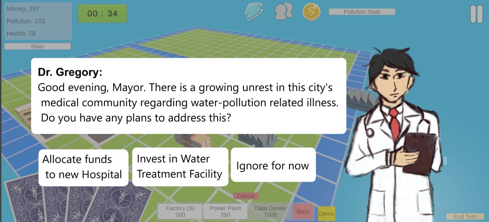
*Figure 12: A Mock-Up of a Health-Related Event*

### Special Event Buildings

Certain kinds of infrastructure are also unique to events. For example, the Data Center building will only be made available to players once the corresponding event has been triggered. For this event to occur, the player will need to generate an excess amount of energy in their city that can be allocated to the Data Center.

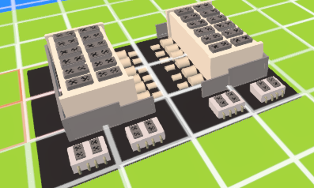
*Figure 13: Data Center Building*

## Game Conclusion

The player will navigate this system through multiple turns until they reach the final one. After this, the player will be evaluated based on their performance. Their success metrics are displayed on the end of game screen, where they will have the option to restart the game, exit, or return to the title screen.

## Educational Goals

Success in the game is based on how well the player was able to maximize the city's economic prosperity and the population's health. As the player progresses in the game, the relationship between the two should become clearer. After concluding the game, the player should be reflecting on their decisions, how they could have done better, and how the lessons and concepts learned in the game can be applied to the real world.
